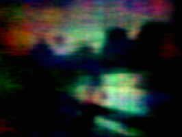
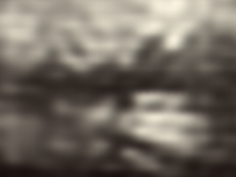
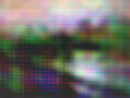

# Использование ADMM для реконструкции безлинзовых изображений

В данном проекте реализованы методы реконструкции для датасета безлинзовых изображений [DigiCam-Mirflickr-MultiMask-10K](https://huggingface.co/datasets/bezzam/DigiCam-Mirflickr-MultiMask-10K). Были обучены несколько моделей: базовый ADMM с фиксированными параметрами, обучаемый LeADMM и модульные варианты LeADMM с пред- и постпроцессорами DRUNet.

## Реализованные модели

- **ADMM-100**: 100 итераций с фиксированными `mu_1 = mu_2 = mu_3 = 1e-4` и `tau = 2e-4`.
- **LeADMM-20**: 20 итераций с обучаемыми значениями `mu_1`, `mu_2`, `mu_3` и `tau`.
- **Modular LeADMM-5 Pre+Post**: пять итераций с обучаемыми CNN-пред- и постпроцессорами.
- **Modular LeADMM-5 Pre**: пять итераций с обучаемым CNN-предпроцессором.
- **Modular LeADMM-5 Post**: пять итераций с обучаемым CNN-постпроцессором.

## Установка

```bash
git clone https://github.com/glebustim/dl-hw05-project-glebustim.git
cd dl-hw05-project-glebustim
pip install -r requirements.txt
```

Для скачивания датасета можно использовать код `download_dataset.py`. Он скачает датасет DigiCam и разместит его в следующем формате в корне репозитория:

```text
DigiCam-Mirflickr-MultiMask-10K/
  train/
    lensless/
    masks/
    lensed/
  test/
    lensless/
    masks/
    lensed/
```

## Обучение

Команда по умолчанию обучает модульную модель с пред- и постпроцессорами:

```bash
python train.py
```

Другую реализацию можно выбрать через переопределение Hydra:

```bash
python train.py model=admm_100
python train.py model=leadmm_20
python train.py model=modular_leadmm_5_pre
python train.py model=modular_leadmm_5_post
python train.py model=modular_leadmm_5_pre_post
```

Также через переопределение Hydra или изменение конфига `src/configs/train.yaml` можно менять число итераций обучения, а также ограничивать число элементов в обучащем датасете (что я делал при обучении LeADMM-20 и Modular LeADMM-5 Pre+Post, так как их обучение не успевало посчитаться в ограниченные сроки).

Чекпоинты сохраняются в папке с именем выбранной модели.

## Предобученные чекпоинты

Обучаемые модели опубликованы на Hugging Face:

| Модель | Репозиторий с чекпоинтом | Финальный чекпоинт |
| --- | --- | --- |
| LeADMM-20 | [glebustim/leadmm_20](https://huggingface.co/glebustim/leadmm_20) | `checkpoint-epoch6.pth` |
| Modular LeADMM-5 Pre+Post | [glebustim/modular_leadmm_5_pre_post](https://huggingface.co/glebustim/modular_leadmm_5_pre_post) | `checkpoint-epoch4.pth` |
| Modular LeADMM-5 Pre | [glebustim/modular_leadmm_5_pre](https://huggingface.co/glebustim/modular_leadmm_5_pre) | `checkpoint-epoch8.pth` |
| Modular LeADMM-5 Post | [glebustim/modular_leadmm_5_post](https://huggingface.co/glebustim/modular_leadmm_5_post) | `checkpoint-epoch8.pth` |

В ADMM-100 используются фиксированные гиперпараметры, поэтому чекпоинт не нужен. Обученный чекпоинт можно скачать в локальный каталог так:

```bash
pip install huggingface_hub
python -c "from huggingface_hub import hf_hub_download; hf_hub_download(repo_id='glebustim/leadmm_20', filename='checkpoint-epoch6.pth', local_dir='checkpoints/leadmm_20')"
```

## Инференс

Запуск ADMM-100 с фиксированными параметрами на тестовой выборке:

```bash
python inference.py model=admm_100 ~datasets.train dataloader.shuffle=false inferencer.skip_model_load=true inferencer.save_path=admm_100
```

Запуск LeADMM-20 со скачанным чекпоинтом:

```bash
python inference.py model=leadmm_20 ~datasets.train dataloader.shuffle=false inferencer.from_pretrained=checkpoints/leadmm_20/checkpoint-epoch6.pth inferencer.save_path=leadmm_20
```

Чтобы запустить модульную модель, замените `model`, `inferencer.from_pretrained` и `inferencer.save_path` соответствующими значениями из таблицы чекпоинтов. Реконструкции сохраняются в `data/saved/<save_path>/test/` с исходными идентификаторами изображений.

## Метрики

`calculate_metrics.py` оценивает сохранённые реконструкции относительно исходных изображений.

```bash
python calculate_metrics.py --lensed_dir DigiCam-Mirflickr-MultiMask-10K/test/lensed --recon_dir data/saved/leadmm_20/test
```

## Демонстрация

[demo.ipynb](demo.ipynb) скачивает чекпоинт Modular LeADMM-5 Pre, выполняет реконструкцию и показывает результаты, считает метрики при наличии оригинальных изображений в датасете.

## Результаты

Результаты `calculate_metrics.py` на тестовой выборке для каждой модели. Время инференса - время, за которое отработал скрипт inference.py для данной модели. Для самостоятельного замерения времени можно запустить данный скрипт, который восстанавливает изображения и считает метрики по батчам, и посмотреть итоговое время, которое будет написано в шкале tqdm.

| Модель | MSE | LPIPS | PSNR | SSIM | Время инференса |
| --- | ---: | ---: | ---: | ---: | ---: |
| ADMM-100 | 0.138174 | 0.759500 | 9.460061 | 0.205441 | 11:42 |
| LeADMM-20 | 0.084329 | 0.802917 | 11.433484 | 0.344726 | 06:06 |
| Modular LeADMM-5 Pre+Post | 0.037159 | 0.735761 | 14.901828 | 0.401764 | 05:21 |
| Modular LeADMM-5 Pre | 0.039286 | 0.790930 | 14.669575 | 0.372991 | 05:13 |
| Modular LeADMM-5 Post | 0.035394 | 0.722641 | 15.150131 | 0.416587 | 05:05 |

## Примеры реконструкций

Ниже показаны результаты для одного и того же изображения `test_00010`.

| ADMM-100 | LeADMM-20 | Modular LeADMM-5 Pre+Post |
| --- | --- | --- |
|  |  |  |

| Modular LeADMM-5 Pre | Modular LeADMM-5 Post |
| --- | --- |
|  |  |

## Источники
 Проект основан на статьях [Learned reconstructions for practical mask-based lensless imaging](https://arxiv.org/abs/1908.11502) и [Towards Robust and Generalizable Lensless Imaging with Modular Learned Reconstruction](https://arxiv.org/abs/2502.01102).
